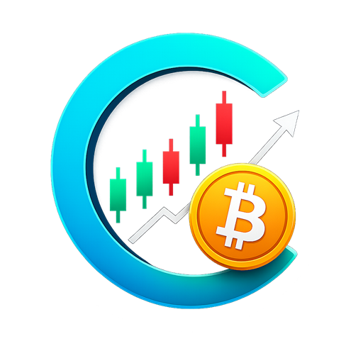
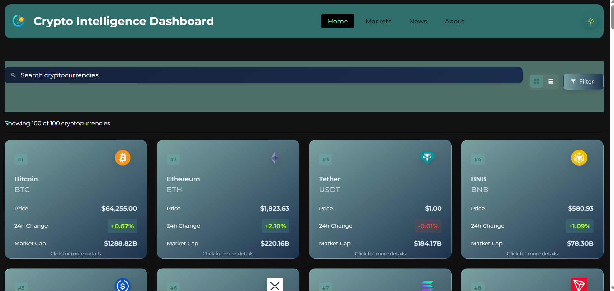
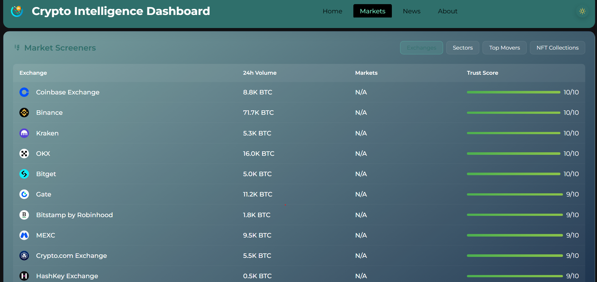
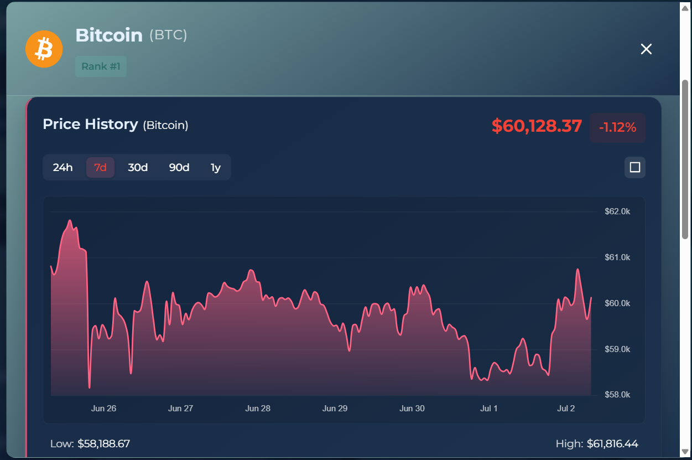

<p align="center">
  
</p>

<h1 align="center">
🚀 Crypto Intelligence Dashboard
</h1>

<p align="center">
A modern cryptocurrency <strong>Market Intelligence Platform</strong> built with React that brings together real-time prices, historical charts, market insights, exchange data, NFT collections, and breaking crypto news into one fast, intuitive dashboard.
</p>

<p align="center">


</p>

<p align="center">

🚀 <a href="https://crypto-intelligent-dashboard.netlify.app" target="_blank"><strong>Live Demo</strong></a> •
📖 <a href="./CASE_STUDY.md"><strong>Case Study</strong></a> •
💻 <a href="https://github.com/Kwebdev1234/crypto-intelligent-dashboard" target="_blank"><strong>GitHub Repository</strong></a>

</p>

---

## 📖 About the Project

The cryptocurrency ecosystem moves fast, but the information needed to track it is often fragmented across multiple platforms. Traders, investors, and curious users frequently jump between different websites for live prices, charts, market sectors, exchanges, NFT collections, and news updates.

**Crypto Intelligence Dashboard** solves that problem by combining these insights into one unified, responsive application. The goal is simple: make cryptocurrency research faster, cleaner, and easier to act on from a single dashboard.

---

## 🎯 The Problem

Cryptocurrency research is often scattered across multiple tools:

- CoinGecko for prices and market data
- CoinMarketCap for rankings and trends
- CryptoCompare for news
- TradingView for chart-based analysis
- Additional platforms for sectors, exchanges, and NFT tracking

This fragmented workflow slows down decision-making, increases context switching, and makes market monitoring less efficient.

---

## 💡 The Solution

I built a single React-based market intelligence platform that brings together:

- ✔ Live cryptocurrency prices
- ✔ Interactive historical charts
- ✔ Global market insights
- ✔ Exchange analytics
- ✔ NFT collection tracking
- ✔ Sector performance analysis
- ✔ Advanced filtering and sorting
- ✔ Smart search
- ✔ Category-based crypto news
- ✔ Responsive user experience

The result is a dashboard designed to simplify crypto market exploration without forcing users to jump across multiple products.

---

## ✨ Key Features

### 📈 Real-Time Market Tracking

- Track **100+ cryptocurrencies** with live market data
- Refresh prices automatically every **60 seconds**
- Monitor price, market cap, trading volume, and 24-hour performance
- Quickly identify gainers and losers with color-coded indicators

### 📊 Interactive Market Analytics

- Explore historical price charts across multiple time ranges
- Visualize performance with interactive Chart.js charts
- View global market statistics and Bitcoin dominance
- Surface trends through market-level insights

### 🔍 Smart Search & Filtering

- Search cryptocurrencies instantly
- Filter by price range and market capitalization
- Switch between grid and list layouts
- Sort by market cap, price, trading volume, or alphabetical order

### 🧠 Market Intelligence Dashboard

- Analyze global market conditions from a single screen
- Explore trending cryptocurrencies and category performance
- Track top gainers, top losers, and highest-volume assets
- Review exchange rankings, sector insights, and NFT collections

### 📰 Crypto News Hub

- Read breaking cryptocurrency news in one place
- Filter content by category such as Bitcoin, Ethereum, DeFi, and business
- Follow market-moving headlines alongside live market data

### 🎨 User Experience

- Fully responsive across mobile, tablet, and desktop
- Smooth loading experience with skeleton states
- Error handling with graceful fallback UI
- Clean navigation and modern dashboard design

---

## 🛠️ Engineering Highlights

This project was built to go beyond a basic crypto tracker and demonstrate product-oriented frontend engineering:

- **Modular React architecture** using reusable components and hooks
- **Efficient state handling** with `useState`, `useEffect`, and memoization patterns
- **API-driven UI** powered by CoinGecko and CryptoCompare
- **Performance optimizations** including debounced search, lazy loading, and caching strategies
- **Robust error handling** for API failures and unstable external data
- **Responsive design system** for a consistent experience across devices

For a deeper breakdown of architecture, decisions, and implementation details, see the 📖 <a href="./CASE_STUDY.md"><strong>Case Study</strong></a>.

---

## 📸 Project Showcase

## 🏠 Home Dashboard

<p align="center">
  
</p>

---

## 📊 Market Insights Dashboard

<p align="center">
  
</p>

---

## 📈 Coin Details

<p align="center">
  
</p>

---

## 📰 Crypto News

<p align="center">
  
</p>

---

## 🎥 Application Demo

▶️ **Watch the demo:** [demo.mp4](./docs/demo.mp4)

---

## 🚀 Market Dashboard Highlights

The Market Dashboard combines multiple intelligence modules into one interface so users can quickly understand market conditions and discover opportunities.

### Included Dashboards

- 📈 Market Summary
- 🔥 Trending Cryptocurrencies
- 💹 Top Gainers
- 📉 Top Losers
- 💰 Highest Volume Assets
- 🏦 Exchange Rankings
- 🧩 Market Sectors
- 🖼️ NFT Collections
- 📊 Cross-Category Market Metrics

These views are designed to help users monitor the broader crypto ecosystem without switching between multiple platforms.

---

## 🛠️ Tech Stack

- **Frontend:** React.js with functional components and hooks
- **Build Tool:** Vite
- **HTTP Client:** Axios
- **Charting:** Chart.js with react-chartjs-2
- **Styling:** Custom CSS3 with responsive layouts, variables, and animations
- **APIs:** CoinGecko API and CryptoCompare API

---

## 🖥️ Project Structure

```bash
crypto-intelligence-dashboard/
│
├── public/                 # Static files
├── src/                    # Source files
│   ├── assets/             # Images, logos, icons
│   ├── components/         # Reusable UI components
│   │   ├── Coin/           # Coin card/list item component
│   │   ├── CoinDetail/     # Detailed view for individual coins
│   │   ├── GlobalInsights/ # Global market metrics
│   │   ├── CategoryInsights/ # Cryptocurrency category analysis
│   │   ├── HistoricalChart/  # Price history charts
│   │   ├── MarketMetrics/    # Market metrics display
│   │   ├── MarketScreener/   # Advanced market screeners
│   │   ├── MarketSummary/    # Market overview data
│   │   └── NewsFeed/         # Cryptocurrency news component
│   ├── hooks/              # Custom React hooks
│   ├── utils/              # Utility functions and API helpers
│   ├── App.jsx             # Main application component
│   ├── App.css             # Main styles
│   └── main.jsx            # Application entry point
├── .eslintrc.cjs           # ESLint configuration
├── index.html              # HTML entry point
├── package.json            # Project dependencies and scripts
└── vite.config.js          # Vite configuration
```

---

## 🚀 Installation

Follow these steps to run the project locally:

1. **Clone the repository**

```bash
git clone https://github.com/Kwebdev1234/crypto-intelligent-dashboard.git
```

2. **Navigate to the project directory**

```bash
cd crypto-intelligence-dashboard
```

3. **Install dependencies**

```bash
npm install
```

4. **Start the development server**

```bash
npm run dev
```

5. **Open the application**

Visit `http://localhost:5173` in your browser.

---

## 👥 Contributing

Contributions are welcome.

1. **Fork the repository**
2. **Create a feature branch**

```bash
git checkout -b feature-name
```

3. **Commit your changes**

```bash
git commit -m "Add some feature"
```

4. **Push to the branch**

```bash
git push origin feature-name
```

5. **Open a pull request**

---

## 📞 Contact

For any inquiries or feedback, please reach out to [kwebdev72@gmail.com](mailto:kwebdev72@gmail.com)

📚 [Detailed Case Study](./CASE_STUDY.md)

---

## 📄 License

This project is licensed under the MIT License - see the LICENSE file for details.
